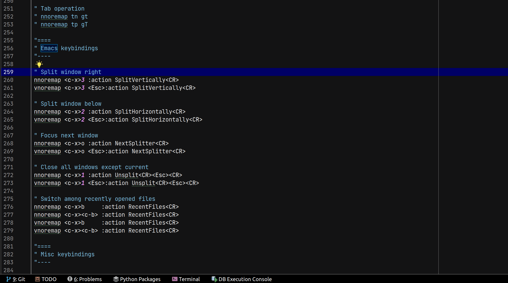
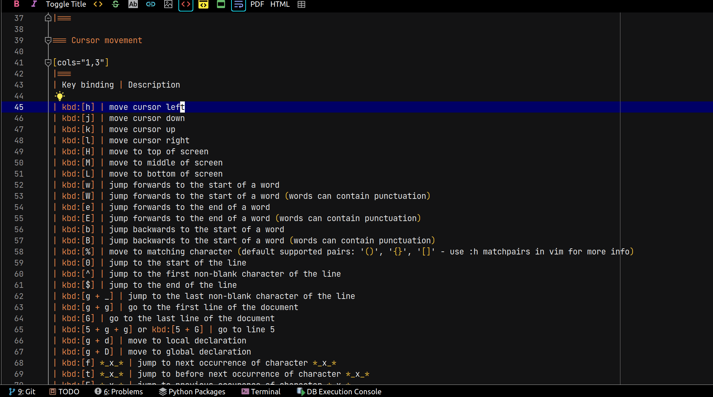
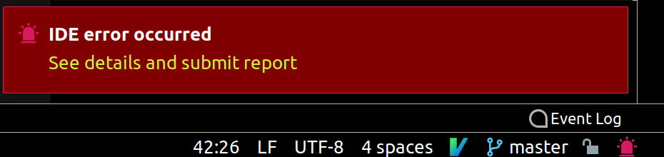

# A Personal Intellimacs/IdeaVim Configuration

## About

After more than a year of using `IntelliJ`, I finally found several plugins that make the IDE looks & feels like `Spacemacs`.

In general, `Spacemacs` key bindings are quite good as they are organised according to mnemonic patterns, however, I'd prefer fewer keystrokes for common tasks, thus you will find these actions are re-bound with prefixes: <kbd>g</kbd> and <kbd>,</kbd>.

We can search what Vim shortcut for a particular task on the Internet, or from the included `intellmacs.{adoc,pdf,html}` document on this page, but I'd prefer to do it from within the IDE. Hence, the configuration has several custom commands to display shortcuts according to its category. These commands are bound with prefix key sequence: <kbd>,</kbd> <kbd>h</kbd>.

## Illustrations

Animated GIF pictures below depict temporary popups showing the next possible keys, and their description that would help users select a wanted action.

### Demo: List Buffers

The key sequence for above picture was: <kbd>SPC</kbd> <kbd>b</kbd> <kbd>b</kbd>

### Demo: Show Essential Vim Navigation Shortcuts

The key sequence to show the Vim shortcuts was: <kbd>,</kbd> <kbd>h</kbd> <kbd>n</kbd> <kbd>e</kbd> <kbd>ENTER</kbd>

## Prerequisites

1. JetBrains IDEs such as `IntellJ`, `PyCharm`, etc.
2. Install `IdeaVim` plugin for your IDE: https://plugins.jetbrains.com/plugin/164-ideavim
3. Install `IDEA Whick-Key`: https://plugins.jetbrains.com/plugin/15976-idea-which-key
4. Install `Intellimacs` according to instructions on its Github page: https://github.com/MarcoIeni/intellimacs

### Installation

1. Download or clone this project.
2. Copy `doc` directory from the project to your *home* directory. Due to limitation of `IdeaVim` plugin, the file-path argument of external command (i.e. `cat` in this case) is relative to *home* directory.
3. Copy content of `ideavimrc` file in the project to your `~/.ideavimrc`.
4. If you are using Windows, you need to replace the `cat` command with `cmd.exe /d /c type` as mentioned in the `ideavimrc`. You may also have to change folder separator to backward-slash (i.e. ``\ ``) for example: `~/` to ``~\ ``.

### Known Issue

You may see error popup during startup as shown below:

However, it is perfectly OK, as it is the way how `IDEA Whick-Key` plugin replaces `VimShortcutKeyAction` of `IdeaVim` with its own handler to intercept key events, and thus it can show the popup window.

## Acknowledgments

Most information in the `itellimacs.adoc` document and description text for the custom commands have been collected from various materials on the Internet, including but not limited to:

- Vim Cheatsheets: https://weibeld.net/vim/cheatsheet.html
- Vim Cheat Sheet for programmers: http://michael.peopleofhonoronly.com/vim/
- Vim Cheat Sheet: https://www.fcodelabs.com/2018/12/08/Vim-Cheats/

Thanks to original authors made them openly available.