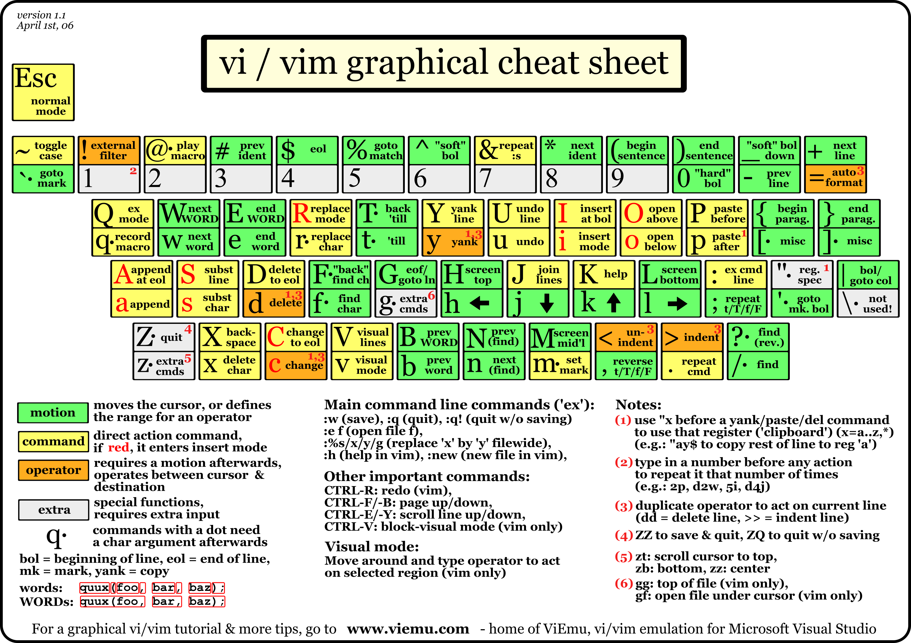

= VIM, IdeaVim & Intellimacs
Version 1.0.4, 2021-04-17
:sectnums:
:toc: left
:toclevels: 4
:toc-title: VIM, IdeaVIM and Intellimacs
:keywords: vim, intellij, spacemacs
:source-highlighter:
:experimental:
:icons: font
:docdate:
:title-page:

== VIM Cheat Sheet

=== Basic Key Bindings

=== Key Bindings for Programmers

image::images/vim_cheat_sheet_for_programmers_print.png[]

== VIM Key Bindings & Commands

=== Global

[cols="1,3"]
|===
| Key binding | Description

| :h[elp] keyword | open help for keyword
| :sav[eas] file | save file as
| :clo[se] | close current pane
| :ter[minal] | open a terminal window
| K | open man page for word under the cursor
|===

=== Cursor movement

[cols="1,3"]
|===
| Key binding | Description

| kbd:[h] | move cursor left
| kbd:[j] | move cursor down
| kbd:[k] | move cursor up
| kbd:[l] | move cursor right
| kbd:[H] | move to top of screen
| kbd:[M] | move to middle of screen
| kbd:[L] | move to bottom of screen
| kbd:[w] | jump forwards to the start of a word
| kbd:[W] | jump forwards to the start of a word (words can contain punctuation)
| kbd:[e] | jump forwards to the end of a word
| kbd:[E] | jump forwards to the end of a word (words can contain punctuation)
| kbd:[b] | jump backwards to the start of a word
| kbd:[B] | jump backwards to the start of a word (words can contain punctuation)
| kbd:[%] | move to matching character (default supported pairs: '()', '{}', '[]' - use :h matchpairs in vim for more info)
| kbd:[0] | jump to the start of the line
| kbd:[^] | jump to the first non-blank character of the line
| kbd:[$] | jump to the end of the line
| kbd:[g + _] | jump to the last non-blank character of the line
| kbd:[g + g] | go to the first line of the document
| kbd:[G] | go to the last line of the document
| kbd:[5 + g + g] or kbd:[5 + G] | go to line 5
| kbd:[g + d] | move to local declaration
| kbd:[g + D] | move to global declaration
| kbd:[f] *_x_* | jump to next occurrence of character *_x_*
| kbd:[t] *_x_* | jump to before next occurrence of character *_x_*
| kbd:[F] *_x_* | jump to previous occurence of character *_x_*
| kbd:[T] *_x_* | jump to after previous occurence of character *_x_*
| kbd:[;] | repeat previous f, t, F or T movement
| kbd:[,] | repeat previous f, t, F or T movement, backwards
| kbd:[}] | jump to next paragraph (or function/block, when editing code)
| kbd:[{] | jump to previous paragraph (or function/block, when editing code)
| kbd:[z + z] | center cursor on screen
| kbd:[CTRL + e] | move screen down one line (without moving cursor)
| kbd:[CTRL + y] | move screen up one line (without moving cursor)
| kbd:[CTRL + b] | move back one full screen
| kbd:[CTRL + f] | move forward one full screen
| kbd:[CTRL + d] | move forward 1/2 a screen
| kbd:[CTRL + u] | move back 1/2 a screen
|===

[TIP]
====
Prefix a cursor movement command with a number to repeat it. For example, kbd:[4 + j] moves down 4 lines.
====

=== Insert mode - inserting/appending text

[cols="1,3"]
|===
| Key binding | Description

| kbd:[i] | insert before the cursor
| kbd:[I] | insert at the beginning of the line
| kbd:[a] | insert (append) after the cursor
| kbd:[A] | insert (append) at the end of the line
| kbd:[o] | append (open) a new line below the current line
| kbd:[O] | append (open) a new line above the current line
| kbd:[e + a] | insert (append) at the end of the word
| kbd:[CTRL + h] | delete the character before the cursor during insert mode
| kbd:[CTRL + w] | delete word before the cursor during insert mode
| kbd:[CTRL + j] | begin new line during insert mode
| kbd:[CTRL + t] | indent (move right) line one shiftwidth during insert mode
| kbd:[CTRL + d] | de-indent (move left) line one shiftwidth during insert mode
| kbd:[CTRL + n] | insert (auto-complete) next match before the cursor during insert mode
| kbd:[CTRL + p] | insert (auto-complete) previous match before the cursor during insert mode
| kbd:[CTRL + r] *_x_* | insert the contents of register *_x_*
| kbd:[ESC] | exit insert mode
|===

=== Editing

[cols="1,3"]
|===
| Key binding | Description

| kbd:[r] | replace a single character
| kbd:[J] | join line below to the current one with one space in between
| kbd:[g + J] | join line below to the current one without space in between
| kbd:[g + w + i + p] | reflow paragraph
| kbd:[g + ~] | switch case up to motion
| kbd:[g + u] | change to lowercase up to motion
| kbd:[g + U] | change to uppercase up to motion
| kbd:[c + c] | change (replace) entire line
| kbd:[C] | change (replace) to the end of the line
| kbd:[c + $] | change (replace) to the end of the line
| kbd:[c + i + w] | change (replace) entire word
| kbd:[c + w] | change (replace) to the end of the word
| kbd:[s] | delete character and substitute text
| kbd:[S] | delete line and substitute text (same as cc)
| kbd:[x + p] | transpose two letters (delete and paste)
| kbd:[u] | undo
| kbd:[U] | restore (undo) last changed line
| kbd:[CTRL + r] | redo
| kbd:[.] | repeat last command
|===

=== Marking text (visual mode)

[cols="1,3"]
|===
| Key binding | Description

| kbd:[v] | start visual mode, mark lines, then do a command (like y-yank)
| kbd:[V] | start linewise visual mode
| kbd:[o] | move to other end of marked area
| kbd:[CTRL + v] | start visual block mode
| kbd:[O] | move to other corner of block
| kbd:[a + w] | mark a word
| kbd:[a + b] | a block with ()
| kbd:[a + B] | a block with {}
| kbd:[a + t] | a block with <> tags
| kbd:[i + b] | inner block with ()
| kbd:[i + B] | inner block with {}
| kbd:[i + t] | inner block with <> tags
| kbd:[ESC] | exit visual mode
|===

[TIP]
====
Instead of kbd:[b] or kbd:[B] one can also use kbd:[(] or kbd:[{] respectively.
====

=== Visual commands

[cols="1,3"]
|===
| Key binding | Description

| kbd:[>] | shift text right
| kbd:[<] | shift text left
| kbd:[y] | yank (copy) marked text
| kbd:[d] | delete marked text
| kbd:[~] | switch case
| kbd:[u] | change marked text to lowercase
| kbd:[U] | change marked text to uppercase
|===

=== Registers

[cols="1,3"]
|===
| Key binding | Description

| :reg[isters] | show registers content
| kbd:["] *_x_* kbd:[y] | yank into register *_x_*
| kbd:["] *_x_* kbd:[p] | paste contents of register *_x_*
// , is also a delimiter like +
| kbd:[" , + , y] | yank into the system clipboard register
| kbd:[" , + , p] | paste from the system clipboard register
|===

[TIP]
====
Special registers:

[cols="1,5"]
|===
| Register | Description

| [big blue]*0* | last yank
| [big blue]*"* | unnamed register, last delete or yank
| [big blue]*%* | current file name
| [big blue]*#* | alternate file name
| [big blue]*** | clipboard contents (X11 primary)
| [big blue]*+* | clipboard contents (X11 clipboard)
| [big blue]*/* | last search pattern
| [big blue]*:* | last command-line
| [big blue]*.* | last inserted text
| [big blue]*-* | last small (less than a line) delete
| [big blue]*=* | expression register
| [big blue]*_* | black hole register
|===
====

=== Marks and positions

[cols="1,3"]
|===
| Key binding | Description

| :marks | list of marks
| kbd:[m] *_a_* | set current position for mark *_a_*
| kbd:[`] *_a_* | jump to position of mark *_a_*
| kbd:[y + `] *_a_* | yank text to position of mark *_a_*
| kbd:[` + 0] | go to the position where Vim was previously exited
| kbd:[` + "] | go to the position when last editing this file
| kbd:[` + .] | go to the position of the last change in this file
| kbd:[` + `] | go to the position before the last jump
| :ju[mps] | list of jumps
| kbd:[CTRL + i] | go to newer position in jump list
| kbd:[CTRL + o] | go to older position in jump list
| :changes | list of changes
| kbd:[g + ,] | go to newer position in change list
| kbd:[g + ;] | go to older position in change list
| kbd:[CTRL + \]] | jump to the tag under cursor
|===

[TIP]
====
To jump to a mark you can either use a backtick (kbd:[`]) or an apostrophe (kbd:[']). Using an apostrophe jumps to the
beginning(first non-black) of the line holding the mark.
====

=== Macros

[cols="1,3"]
|===
| Key binding | Description

| kbd:[q] *_a_* | record macro *_a_*
| kbd:[q] | stop recording macro
| kbd:[@] *_a_* | run macro *_a_*
| kbd:[@ + @] | rerun last run macro
|===

=== Cut and paste

[cols="1,3"]
|===
| Key binding | Description

| kbd:[y + y] | yank (copy) a line
| kbd:[2 + y + y] | yank (copy) 2 lines
| kbd:[y + w] | yank (copy) the characters of the word from the cursor position to the start of the next word
| kbd:[y + $] | yank (copy) to end of line
| kbd:[p] | put (paste) the clipboard after cursor
| kbd:[P] | put (paste) before cursor
| kbd:[d + d] | delete (cut) a line
| kbd:[2 + d + d] | delete (cut) 2 lines
| kbd:[d + w] | delete (cut) the characters of the word from the cursor position to the start of the next word
| kbd:[D] | delete (cut) to the end of the line
| kbd:[d + $] | delete (cut) to the end of the line
| kbd:[x] | delete (cut) character
|===

=== Indent text

[cols="1,3"]
|===
| Key binding | Description

| kbd:[> + >] | indent (move right) line one shiftwidth
| kbd:[< + <] | de-indent (move left) line one shiftwidth
| kbd:[> + %] | indent a block with () or {} (cursor on brace)
| kbd:[> + i + b] | indent inner block with ()
| kbd:[> + a + t] | indent a block with <> tags
| kbd:[3 + = + =] | re-indent 3 lines
| kbd:[= + %] | re-indent a block with () or {} (cursor on brace)
| kbd:[= + i + B] | re-indent inner block with {}
| kbd:[g + g + = + G] | re-indent entire buffer
| kbd:[\] + p] | paste and adjust indent to current line
|===

=== Exiting

[cols="1,3"]
|===
| Ex command| Description

| :w | write (save) the file, but don't exit
| :w !sudo tee % | write out the current file using sudo
| :wq or :x or ZZ | write (save) and quit
| :q | quit (fails if there are unsaved changes)
| :q! or ZQ | quit and throw away unsaved changes
| :wqa | write (save) and quit on all tabs
|===

=== Search and replace

[cols="1,3"]
|===
| Key binding | Description

| kbd:[/]*_pattern_* | search for *_pattern_*
| kbd:[?]*_pattern_* | search backward for *_pattern_*
| kbd:[\ + v]*_pattern_* | 'very magic' *_pattern_*: non-alphanumeric characters are interpreted as special regex symbols (no escaping needed)
| kbd:[n] | repeat search in same direction
| kbd:[N] | repeat search in opposite direction
| :%s/[blue]*_old_*/[red]*_new_*/g | replace all [blue]*_old_* with [red]*_new_* throughout file
| :%s/[blue]*_old_*/[red]*_new_*/gc | replace all [blue]*_old_* with [red]*_new_* throughout file with confirmations
| :noh[lsearch] | remove highlighting of search matches
|===

=== Search in multiple files

[cols="1,2"]
|===
| Ex command | Description

| :vim[grep] /*_pattern_*/ {`{file}`} | search for *_pattern_* in multiple files e.g. `:vim[grep] /foo/ **/*`
| :cn[ext] | jump to the next match
| :cp[revious] | jump to the previous match
| :cope[n] | open a window containing the list of matches
| :ccl[ose] | close the quickfix window
|===

=== Tabs

[cols="2,3"]
|===
| Key binding | Description

| :tabnew or :tabnew {page.words.file} | open a file in a new tab
| kbd:[CTRL + w + T] | move the current split window into its own tab
| kbd:[g + t] or :tabn[ext] | move to the next tab
| kbd:[g + T] or :tabp[revious] | move to the previous tab
| kbd:[# + g + t] | move to tab number #
| :tabm[ove] # | move current tab to the #th position (indexed from 0)
| :tabc[lose] | close the current tab and all its windows
| :tabo[nly] | close all tabs except for the current one
| :tabdo command | run the command on all tabs (e.g. :tabdo q - closes all opened tabs)
|===

=== Working with multiple files

[cols="1,3"]
|===
| Key binding | Description

| :e[dit] *_file_* | edit a *_file_* in a new buffer
| :bn[ext] | go to the next buffer
| :bp[revious] | go to the previous buffer
| :bd[elete] | delete a buffer (close a file)
| :b[uffer]# | go to a buffer by index #
| :b[uffer] *_file_* | go to a buffer by *_file_*
| :ls or :buffers | list all open buffers
| :sp[lit] *_file_* | open a *_file_* in a new buffer and split window
| :vs[plit] *_file_* | open a *_file_* in a new buffer and vertically split window
| :vert[ical] ba[ll] | edit all buffers as vertical windows
| :tab ba[ll] | edit all buffers as tabs
| kbd:[CTRL + w + s] | split window
| kbd:[CTRL + w + v] | split window vertically
| kbd:[CTRL + w + w] | switch windows
| kbd:[CTRL + w + q] | quit a window
| kbd:[CTRL + w + x] | exchange current window with next one
| kbd:[CTRL + w + =] | make all windows equal height & width
| kbd:[CTRL + w + h] | move cursor to the left window (vertical split)
| kbd:[CTRL + w + l] | move cursor to the right window (vertical split)
| kbd:[CTRL + w + j] | move cursor to the window below (horizontal split)
| kbd:[CTRL + w + k] | move cursor to the window above (horizontal split)
|===

=== Diff

[cols="1,3"]
|===
| Key binding | Description

| kbd:[z + f] | manually define a fold up to motion
| kbd:[z + d] | delete fold under the cursor
| kbd:[z + a] | toggle fold under the cursor
| kbd:[z + o] | open fold under the cursor
| kbd:[z + c] | close fold under the cursor
| kbd:[z + r] | reduce (open) all folds by one level
| kbd:[z + m] | fold more (close) all folds by one level
| kbd:[z + i] | toggle folding functionality
| kbd:[\] + c] | jump to start of next change
| kbd:[[ + c] | jump to start of previous change
| kbd:[d + o] or :diffg[et] | obtain (get) difference (from other buffer)
| kbd:[d + p] or :diffpu[t] | put difference (to other buffer)
| :diffthis | make current window part of diff
| :dif[fupdate] | update differences
| :diffo[ff] | switch off diff mode for current window
|===

[TIP]
====
The commands for folding (e.g. kbd:[z + a]) operate on one level. To operate on all levels, use uppercase letters
(e.g. kbd:[z + A]).
====

[TIP]
====
To view the differences of files, one can directly start Vim in diff mode by running `vimdiff` in a terminal.
One can even set this as `git difftool`
====

== Personal IdeaVim Key Binding

[cols="1,3"]
|===
| Key binding | Description

| kbd:[j + j] | The same as kbd:[Esc]: change to Normal mode
// TODO:
//| kbd:[H] | Display this document in Chrome
| kbd:[ALT + x] | Execute an action. Like <M-x>
| kbd:[+] | Increase editor font size
| kbd:[-] | Decrease editor font size
| <leader> kbd:[=] | Reset editor font size
| <leader> kbd:[R + M] | Execute Maven goal
| <leader> kbd:[R + m] | Activate Maven project tool window
|===

[[cg]]
=== Shortcuts start with kbd:[g]

[cols="2,1,4"]
|===
| Group |  Key binding | Description

| Window | kbd:[g + w] | Hide all windows except editor
| Buffer | kbd:[g + y] | Yank entire buffer

.10+| Go or Jump
| kbd:[g + f] | Go Forward
| kbd:[g + b] | Go Back
| kbd:[g + [] | Go to code block start
| kbd:[g + \]] | Go to code block end
| kbd:[g + {] | Go to next method
| kbd:[g + }] | Go to previous method
| kbd:[g + i] | Go to implementation
| kbd:[g + d] | Go to declaration
| kbd:[g + I] | Show quick implementation
| kbd:[g + T] | Show quick type definition

.4+| Search and Navigate
| kbd:[g + C] | Search classes
| kbd:[g + F] | Search files
| kbd:[g + S] | Search symbols
| kbd:[g + B] | Show navigation bar

.2+| Errors
| kbd:[g + x] | Go to next error
| kbd:[g + X] | Go to previous error

.6+| Show References
| kbd:[g + R] | Find usages
| kbd:[g + j] | Show usages
| kbd:[g + s] | Show find structure popup
| kbd:[g + t] | Show type hierarchy
| kbd:[g + m] | Show method hierarchy
| kbd:[g + l] | Show call hierarchy

.2+| Wrap
| kbd:[g + q] | Wrap
| kbd:[g + Q] | Wrap paragraph
|===

=== Shortcuts start with kbd:[,]

[cols="1,1,2"]
|===
| Group |  Key binding | Description

.2+| Configuration
| kbd:[, + .] | Edit `~/.ideavimrc`
| kbd:[, + ,] | Reload `~/.ideavimrc`

| Comment | kbd:[, + ;] | Comment a line

.29+| Help
| kbd:[, + h] | Help/Shortcuts group
| kbd:[, + h + a] | All shortcuts
| kbd:[, + h + c] | Macro
| kbd:[, + h + e] | Edit group
| kbd:[, + h + e + e] | Editing
| kbd:[, + h + e + c] | Cut & Paste
| kbd:[, + h + e + f] | Editing multiple files
| kbd:[, + h + g] | General/Misc
| kbd:[, + h + i] | Insert Mode
| kbd:[, + h + m] | Marks
| kbd:[, + h + n] | Navigation group
| kbd:[, + h + n + e] | Navigation essential
| kbd:[, + h + n + b] | Navigation block
| kbd:[, + h + n + /] | Navigation character search
| kbd:[, + h + n + c] | Navigation code block
| kbd:[, + h + n + h] | Navigation cursor
| kbd:[, + h + n + l] | Navigation line
| kbd:[, + h + n + m] | Navigation marker
| kbd:[, + h + n + o] | Navigation other
| kbd:[, + h + n + w] | Navigation word
| kbd:[, + h + o] | Operators
| kbd:[, + h + p] | Paging
| kbd:[, + h + q] | Quit
| kbd:[, + h + r] | Search Replace
| kbd:[, + h + s] | Search multiple files
| kbd:[, + h + t] | Tabs
| kbd:[, + h + x] | Text Objects
| kbd:[, + h + v] | Visual Mode
| kbd:[, + h + w] | Windows

.3+| Yank and Paste
| kbd:[, + y] | Yank selection to clipboard
| kbd:[, + y + y] | Yank current line to clipboard
| kbd:[, + p] | Paste from clipboard

.4+| Misc
| kbd:[, + a] | Show argument/parameter info
| kbd:[, + b] | Show bookmarks
| kbd:[, + l] | Show recent locations
| kbd:[, + m] | Show popup menu

.2+| Find
| kbd:[, + f] | Find
| kbd:[, + /] | Find in project

.5+| Refactorings
| kbd:[, + R] | Refactorings popup menu
| kbd:[, + r + r] | Rename
| kbd:[, + r + g] | Generate
| kbd:[, + r + i] | Optimise imports
| kbd:[, + r + c] | Inspect code

.2+| Git
| kbd:[, + g] | Git menu
| kbd:[, + G] | VCS menu
|===

//=== Shortcuts start with kbd:[z]

=== Shortcuts start with kbd:[+\+]

[cols="1,3"]
|===
| Key binding | Description

| kbd:[+\+] | kbd:[<Leader> + m] - prefix key of Intellimacs major mode
|===

=== Emacs shortcuts

[cols="2,2,3"]
|===
| Group |  Key binding | Description

.4+| Window layout (Emacs)
| kbd:[CTRL + x + 3] | Split window vertically
| kbd:[CTRL + x + 2] | Split window horizontally
| kbd:[CTRL + x + o] | next split window
| kbd:[CTRL + x + 1] | un-split window

.2+| Buffers
| kbd:[CTRL + x + b] | List buffers
| kbd:[CTRL + x + CTRL + b] | List buffers
|===

== IdeaVim

=== Insert Mode

[cols="1,3"]
|===
| Key binding | Description

| kbd:[CTRL + @] | change.insert.InsertPreviousInsertExitAction
| kbd:[CTRL + a] | change.insert.InsertPreviousInsertAction
| kbd:[CTRL + c] | change.insert.InsertExitModeAction
| kbd:[CTRL + d] | change.shift.ShiftLeftLinesAction
| kbd:[CTRL + e] | change.insert.InsertCharacterBelowCursorAction
| kbd:[CTRL + g + j] |
| kbd:[CTRL + g + k] |
| kbd:[CTRL + g + u] |
| kbd:[BS] |       editor.VimEditorBackSpace
| kbd:[digraph] |  IdeaVim enter digraph
| kbd:[CTRL + h] | IntelliJ editor backspace
| kbd:[TAB] |      editor.VimEditorTab
| kbd:[CTRL + i] | IntelliJ editor tab
| kbd:[ENTER] |    change.insert.InsertEnterAction
| kbd:[CTRL + j] |
| kbd:[CTRL + k] | change.insert.InsertCompletedDigraphAction
| kbd:[CTRL + l] |
| kbd:[CTRL + m] | change.insert.InsertEnterAction
| kbd:[CTRL + n] | window.LookupDownAction
| kbd:[CTRL + o] | change.insert.InsertSingleCommandAction
| kbd:[CTRL + p] | window.LookupUpAction
| kbd:[CTRL + q] |
| kbd:[CTRL + r] | change.insert.InsertRegisterAction
| kbd:[CTRL + r + CTRL + r] |
| kbd:[CTRL + r + CTRL + o] |
| kbd:[CTRL + r + CTRL + p] |
| kbd:[CTRL + t] | change.shift.ShiftRightLinesAction
| kbd:[CTRL + u] | change.insert.InsertDeleteInsertedTextAction
| kbd:[CTRL + v] | change.insert.InsertCompletedLiteralAction
| kbd:[CTRL + v + digit] | change.insert.InsertCompletedLiteralAction
| kbd:[CTRL + w] | change.insert.InsertDeletePreviousWordAction
| kbd:[CTRL + x] |
| kbd:[CTRL + y] | change.insert.InsertCharacterAboveCursorAction
| kbd:[CTRL + z] |
| kbd:[ESC] |      change.insert.InsertExitModeAction
| kbd:[CTRL + [] | change.insert.InsertExitModeAction
| kbd:[CTRL + \ + CTRL + N] | ResetModeAction
| kbd:[CTRL + \ + CTRL + G] |
| kbd:[CTRL + }] |
| kbd:[CTRL + ^] |
| kbd:[CTRL + _] |
| kbd:[0 + CTRL + d] |
| kbd:[^ + CTRL + d] |
| kbd:[DEL] |           editor.VimEditorDelete
| kbd:[LEFT] |          motion.leftright.MotionLeftInsertModeAction
| kbd:[SHIFT + LEFT] |  motion.text.MotionWordLeftInsertAction
| kbd:[CTRL + LEFT] |   motion.text.MotionWordLeftInsertAction
| kbd:[RIGHT] |         motion.leftright.MotionRightInsertAction
| kbd:[SHIFT + RIGHT] | motion.text.MotionWordRightInsertAction
| kbd:[CTRL + RIGHT] |  motion.text.MotionWordRightInsertAction
| kbd:[UP] |            editor.VimEditorUp
| kbd:[SHIFT + UP] |    motion.scroll.MotionScrollPageUpInsertModeAction
| kbd:[DOWN] |          editor.VimEditorDown
| kbd:[SHIFT + DOWN] |  motion.scroll.MotionScrollPageDownInsertModeAction
| kbd:[HOME] |          motion.leftright.MotionFirstColumnInsertModeAction
| kbd:[CTRL + HOME] |   motion.updown.MotionGotoLineFirstInsertAction
| kbd:[END] |           motion.leftright.MotionLastColumnInsertAction
| kbd:[CTRL + END] |    motion.updown.MotionGotoLineLastEndInsertAction
| kbd:[INSERT] |        change.insert.InsertInsertAction
| kbd:[PAGEUP] |        motion.scroll.MotionScrollPageUpInsertModeAction
| kbd:[PAGEDOWN] |      motion.scroll.MotionScrollPageDownInsertModeAction
| kbd:[F1] |            IntelliJ help
| kbd:[INSERT] |        IntelliJ editor toggle insert/replace
| kbd:[CTRL + X + index] |
|===

=== Normal mode

[cols="1,3"]
|===
| Key binding | Description

| kbd:[CTRL + a] |     change.change.number.ChangeNumberIncAction
| kbd:[CTRL + b] |     motion.scroll.MotionScrollPageUpAction
| kbd:[CTRL + c] |
| kbd:[CTRL + d] |     motion.scroll.MotionScrollHalfPageDownAction
| kbd:[CTRL + e] |     motion.scroll.MotionScrollLineDownAction
| kbd:[CTRL + f] |     motion.scroll.MotionScrollPageDownAction
| kbd:[CTRL + g] |     file.FileGetFileInfoAction
| kbd:[BS] |           motion.leftright.MotionLeftWrapAction
| kbd:[CTRL + h] |     motion.leftright.MotionLeftWrapAction
| kbd:[TAB] |
| kbd:[CTRL + i] |     motion.mark.MotionJumpNextAction
| kbd:[ENTER] |        motion.updown.MotionDownNotLineWiseAction
| kbd:[CTRL + j] |
| kbd:[CTRL + l] |     not applicable
| kbd:[ENTER] |        motion.updown.EnterNormalAction
| kbd:[CTRL + m] |     motion.updown.MotionDownFirstNonSpaceAction
| kbd:[CTRL + n] |     motion.updown.MotionDownCtrlNAction
| kbd:[CTRL + o] |     motion.mark.MotionJumpPreviousAction
| kbd:[CTRL + p] |     motion.updown.MotionUpCtrlPAction
| kbd:[CTRL + r] |     change.RedoAction
| kbd:[CTRL + t] |
| kbd:[CTRL + u] |     motion.scroll.MotionScrollHalfPageUpAction
| kbd:[CTRL + v] |     motion.visual.VisualToggleBlockModeAction
| kbd:[CTRL + w] |     see window commands
| kbd:[CTRL + x] |     change.change.number.ChangeNumberDecAction
| kbd:[CTRL + y] |     motion.scroll.MotionScrollLineUpAction
| kbd:[CTRL + z] |
| kbd:[CTRL + \]] |    motion.search.GotoDeclarationAction
| kbd:[CTRL + 6] |     file.FilePreviousAction
| kbd:[CTRL + \]] kbd:[CTRL + N] | ResetModeAction
| kbd:[!] |            change.change.FilterMotionAction
| kbd:[!!] |           translated to !_
| kbd:[#] |            motion.search.SearchWholeWordBackwardAction
| kbd:[$] |            motion.leftright.MotionLastColumnAction
| kbd:[%] |            motion.updown.MotionPercentOrMatchAction
| kbd:[&] |            change.change.ChangeLastSearchReplaceAction
| kbd:['] |            motion.mark.MotionGotoMarkLineAction
| kbd:[(] |            motion.text.MotionSentencePreviousStartAction
| kbd:[)] |            motion.text.MotionSentenceNextStartAction
| kbd:[*] |            motion.search.SearchWholeWordForwardAction
| kbd:[+] |            motion.updown.MotionDownFirstNonSpaceAction
| kbd:[,] |            motion.leftright.MotionLastMatchCharReverseAction
| kbd:[-] |            motion.updown.MotionUpFirstNonSpaceAction
| kbd:[.] |            change.RepeatChangeAction
| kbd:[/] |            motion.search.SearchEntryFwdAction
| kbd:[:] |            ExEntryAction
| kbd:[;] |            motion.leftright.MotionLastMatchCharAction
| kbd:[<] |            change.shift.ShiftLeftMotionAction
| kbd:[< + <] |        translated to <_
| kbd:[=] |            change.shift.AutoIndentMotionAction
| kbd:[= + =] |           translated to =_
| kbd:[>] |            change.shift.ShiftRightMotionAction
| kbd:[> + >] |        translated to >_
| kbd:[?] |            motion.search.SearchEntryRevAction
| kbd:[@] |            macro.PlaybackRegisterAction
| kbd:[A] |            change.insert.InsertAfterLineEndAction
| kbd:[B] |            motion.text.MotionBigWordLeftAction
| kbd:[C] |            change.change.ChangeEndOfLineAction
| kbd:[D] |            change.delete.DeleteEndOfLineAction
| kbd:[E] |            motion.text.MotionBigWordEndRightAction
| kbd:[F] |            motion.leftright.MotionLeftMatchCharAction
| kbd:[G] |            motion.updown.MotionGotoLineLastAction
| kbd:[H] |            motion.screen.MotionFirstScreenLineAction
| kbd:[H] |            motion.screen.MotionOpPendingFirstScreenLineAction
| kbd:[I] |            change.insert.InsertBeforeFirstNonBlankAction
| kbd:[J] |            change.delete.DeleteJoinLinesSpacesAction
| kbd:[K] |            editor.VimQuickJavaDoc
| kbd:[L] |            motion.screen.MotionLastScreenLineAction
| kbd:[L] |            motion.screen.MotionOpPendingLastScreenLineAction
| kbd:[M] |            motion.screen.MotionMiddleScreenLineAction
| kbd:[N] |            motion.search.SearchAgainPreviousAction
| kbd:[O] |            change.insert.InsertNewLineAboveAction
| kbd:[P] |            copy.PutTextBeforeCursorAction
| kbd:[Q] |
| kbd:[R] |            change.change.ChangeReplaceAction
| kbd:[S] |            change.change.ChangeLineAction
| kbd:[T] |            motion.leftright.MotionLeftTillMatchCharAction
| kbd:[U] |
| kbd:[V] |            motion.visual.VisualToggleLineModeAction
| kbd:[W] |            motion.text.MotionBigWordRightAction
| kbd:[X] |            change.delete.DeleteCharacterLeftAction
| kbd:[Y] |            copy.YankLineAction
| kbd:[Z + Z] |        file.FileSaveCloseAction
| kbd:[Z + Q] |        file.FileSaveCloseAction
| kbd:[[] |            see bracket commands
| kbd:[\]] |           see bracket commands
| kbd:[^] |            motion.leftright.MotionFirstNonSpaceAction
| kbd:[_] |            motion.updown.MotionDownLess1FirstNonSpaceAction
| kbd:[`] |            motion.mark.MotionGotoMarkAction
| kbd:[0] |            motion.leftright.MotionFirstColumnAction
| kbd:[a] |            change.insert.InsertAfterCursorAction
| kbd:[b] |            motion.text.MotionWordLeftAction
| kbd:[c] |            change.change.ChangeMotionAction
| kbd:[c + c] |        translated to c_
| kbd:[d] |            change.delete.DeleteMotionAction
| kbd:[d + d] |        translated to d_
| kbd:[d + o] |
| kbd:[d + p] |
| kbd:[e] |            motion.text.MotionWordEndRightAction
| kbd:[f] |            motion.leftright.MotionRightMatchCharAction
| kbd:[g] |            see commands starting with 'g'
| kbd:[h] |            motion.leftright.MotionLeftAction
| kbd:[i] |            change.insert.InsertBeforeCursorAction
| kbd:[j] |            motion.updown.MotionDownAction
| kbd:[k] |            motion.updown.MotionUpAction
| kbd:[l] |            motion.leftright.MotionRightAction
| kbd:[m] |            motion.mark.MotionMarkAction
| kbd:[n] |            motion.search.SearchAgainNextAction
| kbd:[o] |            change.insert.InsertNewLineBelowAction
| kbd:[p] |            copy.PutTextAfterCursorAction
| kbd:[q] |            macro.ToggleRecordingAction
| kbd:[r] |            change.change.ChangeCharacterAction
| kbd:[s] |            change.change.ChangeCharactersAction
| kbd:[t] |            motion.leftright.MotionRightTillMatchCharAction
| kbd:[u] |            change.UndoAction
| kbd:[v] |            motion.visual.VisualToggleCharacterModeAction
| kbd:[w] |            motion.text.MotionWordRightAction
| kbd:[x] |            change.delete.DeleteCharacterRightAction
| kbd:[y] |            copy.YankMotionAction
| kbd:[y + y] |        translated to y_
| kbd:[z] |            see commands starting with 'z'
| kbd:[{] |            motion.text.MotionParagraphPreviousAction
| kbd:[\|] |            motion.leftright.MotionColumnAction
| kbd:[}] |            motion.text.MotionParagraphNextAction
| kbd:[~] |            change.change.ChangeCaseToggleCharacterAction
| kbd:[CTRL + END] |   motion.updown.MotionGotoLineLastEndAction
| kbd:[CTRL + HOME] |  motion.updown.MotionGotoLineFirstAction
| kbd:[CTRL + LEFT] |  motion.text.MotionWordLeftAction
| kbd:[CTRL + RIGHT] | motion.text.MotionWordRightAction
| kbd:[CTRL + DOWN] |  motion.scroll.CtrlDownAction
| kbd:[CTRL + UP] |    motion.scroll.CtrlUpAction
| kbd:[DEL] |          change.delete.DeleteCharacterAction
| kbd:[DOWN] |         motion.updown.MotionArrowDownAction
| kbd:[END] |          motion.leftright.MotionEndAction
| kbd:[F1] |           IntelliJ help
| kbd:[HOME] |         motion.leftright.MotionHomeAction
| kbd:[INSERT] |       change.insert.InsertBeforeCursorAction
| kbd:[LEFT] |         motion.leftright.MotionArrowLeftAction
| kbd:[PAGEDOWN] |     motion.scroll.MotionScrollPageDownAction
| kbd:[PAGEUP] |       motion.scroll.MotionScrollPageUpAction
| kbd:[RIGHT] |        motion.leftright.MotionArrowRightAction
| kbd:[SHIFT + DOWN] | motion.updown.MotionShiftDownAction
| kbd:[SHIFT + LEFT] | motion.leftright.MotionShiftLeftAction
| kbd:[SHIFT + RIGHT] |motion.leftright.MotionShiftRightAction
| kbd:[SHIFT + UP] |   motion.updown.MotionShiftUpAction
| kbd:[SHIFT + HOME] | motion.leftright.MotionShiftHomeAction
| kbd:[SHIFT + END] |  motion.leftright.MotionShiftEndAction
| kbd:[UP] |           motion.updown.MotionArrowUpAction
|===

==== Window commands kbd:[CTRL + w]

[cols="1,3"]
|===
| Key binding | Description

|kbd:[CTRL + w + +] |
|kbd:[CTRL + w + -] |
|kbd:[CTRL + w + <] |
|kbd:[CTRL + w + =] |
|kbd:[CTRL + w + >] |
|kbd:[CTRL + w + H] |
|kbd:[CTRL + w + J] |
|kbd:[CTRL + w + K] |
|kbd:[CTRL + w + L] |
|kbd:[CTRL + w + P] |
|kbd:[CTRL + w + R] |
|kbd:[CTRL + w + S] |           window.HorizontalSplitAction
|kbd:[CTRL + w + T] |
|kbd:[CTRL + w + W] |           window.WindowPrevAction
|kbd:[CTRL + w + \]] |
|kbd:[CTRL + w + ^] |
|kbd:[CTRL + w + _] |
|kbd:[CTRL + w + b] |
|kbd:[CTRL + w + c] |           window.CloseWindowAction
|kbd:[CTRL + w + d] |
|kbd:[CTRL + w + f] |
|kbd:[CTRL + w + F] |
|kbd:[CTRL + w + g + \]] |
|kbd:[CTRL + w + g + }] |
|kbd:[CTRL + w + g + f] |
|kbd:[CTRL + w + g + F] |
|kbd:[CTRL + w + h] |           window.WindowLeftAction
|kbd:[CTRL + w + i] |
|kbd:[CTRL + w + j] |           window.WindowDownAction
|kbd:[CTRL + w + k] |           window.WindowUpAction
|kbd:[CTRL + w + l] |           window.WindowRightAction
|kbd:[CTRL + w + n] |
|kbd:[CTRL + w + o] |           window.WindowOnlyAction
|kbd:[CTRL + w + p] |
|kbd:[CTRL + w + q] |
|kbd:[CTRL + w + r] |
|kbd:[CTRL + w + s] |           window.HorizontalSplitAction
|kbd:[CTRL + w + t] |
|kbd:[CTRL + w + v] |           window.VerticalSplitAction
|kbd:[CTRL + w + w] |           window.WindowNextAction
|kbd:[CTRL + w + x] |
|kbd:[CTRL + w + z] |
|kbd:[CTRL + w + \|] |
|kbd:[CTRL + w + }] |
|kbd:[CTRL + w + DOWN] |        window.WindowDownAction
|kbd:[CTRL + w + UP] |          window.WindowUpAction
|kbd:[CTRL + w + LEFT] |        window.WindowLeftAction
|kbd:[CTRL + w + RIGHT] |       window.WindowRightAction
|kbd:[CTRL + w + CTRL + H] |    window.WindowLeftAction
|kbd:[CTRL + w + CTRL + J] |    window.WindowDownAction
|kbd:[CTRL + w + CTRL + K] |    window.WindowUpAction
|kbd:[CTRL + w + CTRL + L] |    window.WindowRightAction
|===

==== Square bracket commands kbd:[[] or kbd:[\]]

[cols="1,3"]
|===
| Key binding | Description

| kbd:[[ + CTRL + D] |
| kbd:[[ + CTRL + I] |
| kbd:[[ + #] |
| kbd:[[ + '] |
| kbd:[[ + (] |        motion.text.MotionUnmatchedParenOpenAction
| kbd:[[ + *] |
| kbd:[[ + `] |
| kbd:[[ + /] |
| kbd:[[ + D] |
| kbd:[[ + I] |
| kbd:[[ + M] |        motion.text.MotionMethodPreviousEndAction
| kbd:[[ + P] |        copy.PutVisualTextBeforeCursorNoIndentAction
| kbd:[[ + P] |        copy.PutTextBeforeCursorNoIndentAction
| kbd:[[ + [] |        motion.text.MotionSectionBackwardStartAction
| kbd:[[ + \]] |       motion.text.MotionSectionBackwardEndAction
| kbd:[[ + c] |
| kbd:[[ + d] |
| kbd:[[ + f] |
| kbd:[[ + i] |
| kbd:[[ + m] |        motion.text.MotionMethodPreviousStartAction
| kbd:[[ + p] |        copy.PutVisualTextAfterCursorNoIndentAction
| kbd:[[ + p] |        copy.PutTextAfterCursorNoIndentAction
| kbd:[[ + s] |
| kbd:[[ + z] |
| kbd:[[ + {] |        motion.text.MotionUnmatchedBraceOpenAction
| kbd:[] + CTRL + D] |
| kbd:[] + CTRL + I] |
| kbd:[] + #] |
| kbd:[] + '] |
| kbd:[] + )] |        motion.text.MotionUnmatchedParenCloseAction
| kbd:[] + *] |
| kbd:[] + `] |
| kbd:[] + /] |
| kbd:[] + D] |
| kbd:[] + I] |
| kbd:[] + M] |        motion.text.MotionMethodNextEndAction
| kbd:[] + P] |        copy.PutVisualTextBeforeCursorNoIndentAction
| kbd:[] + P] |        copy.PutTextBeforeCursorNoIndentAction
| kbd:[] + [] |        motion.text.MotionSectionForwardStartAction
| kbd:[] + \]] |       motion.text.MotionSectionForwardEndAction
| kbd:[] + c] |
| kbd:[] + d] |
| kbd:[] + f] |
| kbd:[] + i] |
| kbd:[] + m] |        motion.text.MotionMethodNextStartAction
| kbd:[] + p] |        copy.PutVisualTextAfterCursorNoIndentAction
| kbd:[] + p] |        copy.PutTextAfterCursorNoIndentAction
| kbd:[] + s] |
| kbd:[] + z] |
| kbd:[] + }] |        motion.text.MotionUnmatchedBraceCloseAction
|===

==== Commands starting with kbd:[g]

[cols="1,3"]
|===
| Key binding | Description

| kbd:[g + CTRL + A] |  not applicable
| kbd:[g + CTRL + G] |  file.FileGetLocationInfoAction
| kbd:[g + CTRL + H] |  motion.select.SelectEnableBlockModeAction
| kbd:[g + CTRL + \]] |
| kbd:[g + #] |         motion.search.SearchWordBackwardAction
| kbd:[g + $] |         motion.leftright.MotionLastScreenColumnAction
| kbd:[g + &] |         change.change.ChangeLastGlobalSearchReplaceAction
| kbd:[g + '] |         motion.mark.MotionGotoFileMarkLineNoSaveJumpAction - Visual mode
| kbd:[g + '] |         motion.mark.MotionGotoMarkLineNoSaveJumpAction
| kbd:[g + `] |         motion.mark.MotionGotoMarkNoSaveJumpAction
| kbd:[g + *] |         motion.search.SearchWordForwardAction
| kbd:[g + +] |
| kbd:[g + ,] |         Go to next change
| kbd:[g + -] |
| kbd:[g + 0] |         motion.leftright.MotionFirstScreenColumnAction
| kbd:[g + 8] |         file.FileGetHexAction
| kbd:[g + ;] |         Go to last change
| kbd:[g + <] |
| kbd:[g + ?] |
| kbd:[g + ? + g + ?] |
| kbd:[g + D] |         motion.search.GotoDeclarationAction
| kbd:[g + E] |         motion.text.MotionBigWordEndLeftAction
| kbd:[g + F] |         <<cg>>
| kbd:[g + H] |         motion.select.SelectEnableLineModeAction
| kbd:[g + I] |         <<cg>> (change.insert.InsertLineStartAction)
| kbd:[g + J] |         change.delete.DeleteJoinLinesAction
| kbd:[g + N] |         motion.gn.VisualSelectPreviousSearch
| kbd:[g + N] |         motion.gn.GnPreviousTextObject
| kbd:[g + P] |         copy.PutVisualTextBeforeCursorMoveCursorAction
| kbd:[g + P] |         copy.PutTextBeforeCursorActionMoveCursor
| kbd:[g + Q] |         <<cg>>
| kbd:[g + R] |         <<cg>>
| kbd:[g + T] |         <<cg>> (motion.tabs.MotionPreviousTabAction)
| kbd:[g + U] |         change.change.ChangeCaseUpperMotionAction
| kbd:[g + V] |
| kbd:[g + \]] |        <<cg>>
| kbd:[g + ^] |         motion.leftright.MotionFirstScreenNonSpaceAction
| kbd:[g + _] |         motion.leftright.MotionLastNonSpaceAction
| kbd:[g + a] |         file.FileGetAsciiAction
| kbd:[g + d] |         motion.search.GotoDeclarationAction
| kbd:[g + e] |         motion.text.MotionWordEndLeftAction
| kbd:[g + f] |         <<cg>>
| kbd:[g + g] |         motion.updown.MotionGotoLineFirstAction
| kbd:[g + h] |         motion.select.SelectEnableCharacterModeAction
| kbd:[g + i] |         <<cg>> (change.insert.InsertAtPreviousInsertAction)
| kbd:[g + j] |         <<cg>>
| kbd:[g + k] |         motion.updown.MotionUpNotLineWiseAction
| kbd:[g + n] |         motion.gn.VisualSelectNextSearch
| kbd:[g + n] |         motion.gn.GnNextTextObject
| kbd:[g + m] |         <<cg>> (motion.leftright.MotionMiddleColumnAction0
| kbd:[g + o] |         motion.text.MotionNthCharacterAction
| kbd:[g + p] |         copy.PutVisualTextAfterCursorMoveCursorAction
| kbd:[g + p] |         copy.PutTextAfterCursorActionMoveCursor
| kbd:[g + q] |         <<cg>> (change.change.ReformatCodeMotionAction)
| kbd:[g + r] |
| kbd:[g + s] |         <<cg>>
| kbd:[g + t] |         <<cg>> (motion.tabs.MotionNextTabAction)
| kbd:[g + u] |         change.change.ChangeCaseLowerMotionAction
| kbd:[g + v] |         motion.visual.VisualSelectPreviousAction
| kbd:[g + w] |         <<cg>>
| kbd:[g + @] |         change.OperatorAction
| kbd:[g + ~] |         change.change.ChangeCaseToggleMotionAction
| kbd:[g + DOWN] |
| kbd:[g + END] |       motion.leftright.MotionLastScreenColumnAction
| kbd:[g + HOME] |      motion.leftright.MotionFirstScreenColumnAction
| kbd:[g + UP] |        motion.updown.MotionUpNotLineWiseAction
|===

==== Commands starting with kbd:[z]

[cols="1,3"]
|===
| Key binding | Description

| kbd:[z + ENTER] |  motion.scroll.MotionScrollFirstScreenLineStartAction
| kbd:[z + +] |      motion.scroll.MotionScrollFirstScreenLinePageStartAction
| kbd:[z + -] |      motion.scroll.MotionScrollLastScreenLineStartAction
| kbd:[z + .] |      motion.scroll.MotionScrollMiddleScreenLineStartAction
| kbd:[z + =] |
| kbd:[z + A] |
| kbd:[z + C] |      fold.VimCollapseRegionRecursively
| kbd:[z + D] |
| kbd:[z + E] |
| kbd:[z + F] |
| kbd:[z + G] |
| kbd:[z + H] |      motion.scroll.MotionScrollHalfWidthLeftAction
| kbd:[z + L] |      motion.scroll.MotionScrollHalfWidthRightAction
| kbd:[z + M] |      fold.VimCollapseAllRegions
| kbd:[z + N] |
| kbd:[z + O] |      fold.VimExpandRegionRecursively
| kbd:[z + R] |      fold.VimExpandAllRegions
| kbd:[z + W] |
| kbd:[z + X] |
| kbd:[z + ^] |      motion.scroll.MotionScrollLastScreenLinePageStartAction
| kbd:[z + a] |
| kbd:[z + b] |      motion.scroll.MotionScrollLastScreenLineAction
| kbd:[z + c] |      fold.VimCollapseRegion
| kbd:[z + d] |      not applicable
| kbd:[z + e] |      motion.scroll.MotionScrollLastScreenColumnAction
| kbd:[z + f] |      not applicable
| kbd:[z + g] |
| kbd:[z + h] |      motion.scroll.MotionScrollColumnRightAction
| kbd:[z + i] |
| kbd:[z + j] |
| kbd:[z + k] |
| kbd:[z + l] |      motion.scroll.MotionScrollColumnLeftAction
| kbd:[z + m] |
| kbd:[z + n] |
| kbd:[z + o] |      fold.VimExpandRegion
| kbd:[z + r] |
| kbd:[z + s] |      motion.scroll.MotionScrollFirstScreenColumnAction
| kbd:[z + t] |      motion.scroll.MotionScrollFirstScreenLineAction
| kbd:[z + v] |
| kbd:[z + w] |
| kbd:[z + x] |
| kbd:[z + z] |      motion.scroll.MotionScrollMiddleScreenLineAction
| kbd:[z + LEFT] |   motion.scroll.MotionScrollColumnRightAction
| kbd:[z + RIGHT] |  motion.scroll.MotionScrollColumnLeftAction
|===

=== Visual mode

[cols="1,3"]
|===
| Key binding | Description

| kbd:[CTRL + CTRL + n] |   motion.visual.VisualExitModeAction
| kbd:[CTRL + CTRL + g] |
| kbd:[CTRL + a] |          change.change.number.ChangeVisualNumberIncAction
| kbd:[CTRL + c] |          motion.visual.VisualExitModeAction
| kbd:[CTRL + g] |          motion.select.SelectToggleVisualMode
| kbd:[BS] |              NVO mapping
| kbd:[CTRL + h] |          NVO mapping
| kbd:[CTRL + o] |
| kbd:[CTRL + v] |          NVO mapping
| kbd:[ESC] |             motion.visual.VisualExitModeAction
| kbd:[CTRL + x] |          change.change.number.ChangeVisualNumberDecAction
| kbd:[CTRL + \]] |
| kbd:[!] |                 change.change.FilterVisualLinesAction
| kbd:[:] |                 NVO mapping
| kbd:[<] |                 change.shift.ShiftLeftVisualAction
| kbd:[=] |                 change.change.AutoIndentLinesVisualAction
| kbd:[>] |                 change.shift.ShiftRightVisualAction
| kbd:[b + A] |             change.insert.VisualBlockAppendAction
| kbd:[C] |                 change.change.ChangeVisualLinesEndAction
| kbd:[D] |                 change.delete.DeleteVisualLinesEndAction
| kbd:[b + I]|              change.insert.VisualBlockInsertAction
| kbd:[J] |                 change.delete.DeleteJoinVisualLinesSpacesAction
| kbd:[K] |
| kbd:[O] |                 motion.visual.VisualSwapEndsBlockAction
| kbd:[P] |                 copy.PutVisualTextBeforeCursorAction
| kbd:[R] |                 change.change.ChangeVisualLinesAction
| kbd:[S] |                 change.change.ChangeVisualLinesAction
| kbd:[U] |                 change.change.ChangeCaseUpperVisualAction
| kbd:[V] |                 NV mapping
| kbd:[X] |                 change.delete.DeleteVisualLinesAction
| kbd:[Y] |                 copy.YankVisualLinesAction
| kbd:["] |                 motion.object.MotionOuterBlockDoubleQuoteAction
| kbd:[a + '] |             motion.object.MotionOuterBlockSingleQuoteAction
| kbd:[a + (] |             motion.object.MotionOuterBlockParenAction
| kbd:[a + )] |             motion.object.MotionOuterBlockParenAction
| kbd:[a + <] |             motion.object.MotionOuterBlockAngleAction
| kbd:[a + >] |             motion.object.MotionOuterBlockAngleAction
| kbd:[a + B] |             motion.object.MotionOuterBlockBraceAction
| kbd:[a + W] |             motion.object.MotionOuterBigWordAction
| kbd:[a + [] |             motion.object.MotionOuterBlockBracketAction
| kbd:[a + \]] |            motion.object.MotionOuterBlockBracketAction
| kbd:[a + `] |             motion.object.MotionOuterBlockBackQuoteAction
| kbd:[a + b] |             motion.object.MotionOuterBlockParenAction
| kbd:[a + p] |             motion.object.MotionOuterParagraphAction
| kbd:[a + s] |             motion.object.MotionOuterSentenceAction
| kbd:[a + t] |             motion.object.MotionOuterBlockTagAction
| kbd:[a + w] |             motion.object.MotionOuterWordAction
| kbd:[a + {] |             motion.object.MotionOuterBlockBraceAction
| kbd:[a + \]] |              motion.object.MotionOuterBlockBraceAction
| kbd:[c] |                 change.change.ChangeVisualAction
| kbd:[d] |                 change.delete.DeleteVisualAction
| kbd:[g + CTRL + a] |      change.change.number.ChangeVisualNumberAvalancheIncAction
| kbd:[g + CTRL + x] |      change.change.number.ChangeVisualNumberAvalancheDecAction
| kbd:[g + J] |             change.delete.DeleteJoinVisualLinesAction
| kbd:[g + q] |             change.change.ReformatCodeVisualAction
| kbd:[g + v] |             motion.visual.VisualSwapSelectionsAction
| kbd:[g + `] |             motion.mark.MotionGotoFileMarkNoSaveJumpAction
| kbd:[i + "] |             motion.object.MotionInnerBlockDoubleQuoteAction
| kbd:[i + '] |             motion.object.MotionInnerBlockSingleQuoteAction
| kbd:[i + (] |             motion.object.MotionInnerBlockParenAction
| kbd:[i + )] |             motion.object.MotionInnerBlockParenAction
| kbd:[i + <] |             motion.object.MotionInnerBlockAngleAction
| kbd:[i + >] |             motion.object.MotionInnerBlockAngleAction
| kbd:[i + B] |             motion.object.MotionInnerBlockBraceAction
| kbd:[i + W] |             motion.object.MotionInnerBigWordAction
| kbd:[i + [] |             motion.object.MotionInnerBlockBracketAction
| kbd:[i + \]] |            motion.object.MotionInnerBlockBracketAction
| kbd:[i + `] |             motion.object.MotionInnerBlockBackQuoteAction
| kbd:[i + b] |             motion.object.MotionInnerBlockParenAction
| kbd:[i + p] |             motion.object.MotionInnerParagraphAction
| kbd:[i + s] |             motion.object.MotionInnerSentenceAction
| kbd:[i + t] |             motion.object.MotionInnerBlockTagAction
| kbd:[i + w] |             motion.object.MotionInnerWordAction
| kbd:[i + {] |             motion.object.MotionInnerBlockBraceAction
| kbd:[i + }] |             motion.object.MotionInnerBlockBraceAction
| kbd:[o] |                 motion.visual.VisualSwapEndsAction
| kbd:[p] |                 copy.PutVisualTextAfterCursorAction
| kbd:[r] |                 change.change.ChangeVisualCharacterAction
| kbd:[s] |                 change.change.ChangeVisualAction
| kbd:[u] |                 change.change.ChangeCaseLowerVisualAction
| kbd:[v] |                 NV mapping
| kbd:[x] |                 change.delete.DeleteVisualAction
| kbd:[y] |                 copy.YankVisualAction
| kbd:[~] |                 change.change.ChangeCaseToggleVisualAction
| kbd:[`] |                 motion.mark.MotionGotoFileMarkAction
| kbd:['] |                 motion.mark.MotionGotoFileMarkLineAction
|===

=== Select mode

[cols="1,3"]
|===
| Key binding | Description

| kbd:[BS] |                 motion.select.SelectDeleteAction
| kbd:[CR] |                 motion.select.SelectEnterAction
| kbd:[DEL] |                motion.select.SelectDeleteAction
| kbd:[ESC] |                motion.select.SelectEscapeAction
| kbd:[CTRL + g] |           motion.select.SelectToggleVisualMode
| kbd:[SHIFT + DOWN] |       motion.updown.MotionShiftDownAction
| kbd:[SHIFT + LEFT] |       motion.leftright.MotionShiftLeftAction
| kbd:[SHIFT + RIGHT] |      motion.leftright.MotionShiftRightAction
| kbd:[SHIFT + UP] |         motion.updown.MotionShiftUpAction
| kbd:[DOWN] |               motion.updown.MotionArrowDownAction
| kbd:[LEFT] |               motion.select.motion.SelectMotionLeftAction
| kbd:[RIGHT] |              motion.select.motion.SelectMotionRightAction
| kbd:[UP] |                 motion.updown.MotionArrowUpAction
|===

=== Command line editing

[cols="1,3"]
|===
| Key binding | Description

| kbd:[CTRL + a] |
| kbd:[CTRL + b] |         beginLineAction
| kbd:[CTRL + c] |         CancelEntryAction
| kbd:[CTRL + d] |
| kbd:[CTRL + e] |         endLineAction
| kbd:[CTRL + g] |
| kbd:[CTRL + h] |         DeletePreviousCharAction
| kbd:[CTRL + i] |
| kbd:[CTRL + j] |         CompleteEntryAction
| kbd:[CTRL + k] |         Handled by KeyHandler
| kbd:[CTRL + l] |
| kbd:[CTRL + m] |         ex.ProcessExEntryAction
| kbd:[CTRL + n] |         HistoryDownAction
| kbd:[CTRL + p] |         HistoryUpAction
| kbd:[CTRL + q] |         Handled by KeyHandler
| kbd:[CTRL + r] |         InsertRegisterAction
| kbd:[CTRL + r + CTRL + a] |
| kbd:[CTRL + r + CTRL + f] |
| kbd:[CTRL + r + CTRL + l] |
| kbd:[CTRL + r + CTRL + o] |
| kbd:[CTRL + r + CTRL + p] |
| kbd:[CTRL + r + CTRL + r] |
| kbd:[CTRL + r + CTRL + w] |
| kbd:[CTRL + t] |
| kbd:[CTRL + u] |         DeleteToCursorAction
| kbd:[CTRL + v] |         Handled by KeyHandler
| kbd:[CTRL + w] |         DeletePreviousWordAction
| kbd:[CTRL + y] |
| kbd:[CTRL + \ + e] |
| kbd:[CTRL + \ + CTRL + g] |
| kbd:[CTRL + \ + CTRL + n] |
| kbd:[CTRL + _] |         not applicable
| kbd:[CTRL + ^] |         not applicable
| kbd:[CTRL + \]] |
| kbd:[CTRL + [] |         EscapeCharAction
| kbd:[BS] |               DeletePreviousCharAction
| kbd:[CR] |               CompleteEntryAction
| kbd:[CTRL + LEFT] |      previousWordAction
| kbd:[CTRL + RIGHT] |     nextWordAction
| kbd:[DEL] |              deleteNextCharAction
| kbd:[DOWN] |             HistoryDownFilterAction
| kbd:[END] |              endLineAction
| kbd:[ESC] |              EscapeCharAction
| kbd:[HOME] |             #beginLineAction
| kbd:[INSERT] |           ToggleInsertReplaceAction
| kbd:[LEFT] |             #backwardAction
| kbd:[LeftMouse] |        not applicable
| kbd:[MiddleMouse] |
| kbd:[ENTER] |            CompleteEntryAction
| kbd:[PAGEUP] |           HistoryUpAction
| kbd:[PAGEDOWN] |         HistoryDownAction
| kbd:[RIGHT] |            forwardAction
| kbd:[SHIFT + DOWN] |     HistoryDownAction
| kbd:[SHIFT + LEFT] |     previousWordAction
| kbd:[SHIFT + RIGHT] |    nextWordAction
| kbd:[SHIFT + TAB] |
| kbd:[SHIFT + UP] |       HistoryUpAction
| kbd:[TAB] |
| kbd:[UP] |               HistoryUpFilterAction
| kbd:[digraph] |          {char1} <BS> {char2}
| kbd:[wildchar] |
|===

=== Ex commands

[cols="1,3"]
|===
| Command | Handler

|:map|         MapHandler
|:nmap|
|:vmap|
|:omap|
|:imap|
|:cmap|
|:noremap|
|:nnoremap|
|:vnoremap|
|:onoremap|
|:inoremap|
|:cnoremap|
|:shell|       ShellHandler
|:sort|        SortHandler
|:source|      SourceHandler
|:qall|        ExitHandler
|:quitall|     ExitHandler
|:quitall|     ExitHandler
|:wqall|       ExitHandler
|:xall|        ExitHandler
|:command|     CmdHandler
|:delcommand|  DelCmdHandler
|:comclear|    CmdClearHandler
|:help|
|===

[NOTE]
====
The list of supported Ex commands is incomplete.
====

=== Misc commands

[cols="1,3"]
|===
| Key binding | Description

| kbd:[\] + b] | motion.text.MotionCamelEndLeftAction
| kbd:[\] + w] | motion.text.MotionCamelEndRightAction
| kbd:[[ + b] |  motion.text.MotionCamelLeftAction
| kbd:[[ + w] |  motion.text.MotionCamelRightAction
| kbd:[g + (] |  motion.text.MotionSentencePreviousEndAction
| kbd:[g + )] |  motion.text.MotionSentenceNextEndAction
|===

== IdeaVim Plugins

=== NerdTree

[cols="1,3"]
|===
| Key binding | Description

| kbd:[o] | Open files, directories and bookmarks
| kbd:[g + o] | Open selected file, but leave cursor in the NERDTree
| kbd:[t] | Open selected node/bookmark in a new tab
| kbd:[T] | Same as 't' but keep the focus on the current tab
| kbd:[i] | Open selected file in a split window
| kbd:[g + i] | Same as i, but leave the cursor on the NERDTree
| kbd:[s] | Open selected file in a new vsplit
| kbd:[g + s] | Same as s, but leave the cursor on the NERDTree
| kbd:[O] | Recursively open the selected directory
| kbd:[x] | Close the current nodes parent
| kbd:[X] | Recursively close all children of the current node
| kbd:[P] | Jump to the root node
| kbd:[p] | Jump to current nodes parent
| kbd:[K] | Jump up inside directories at the current tree depth
| kbd:[J] | Jump down inside directories at the current tree depth
| kbd:[CTRL+J] | Jump down to next sibling of the current directory
| kbd:[CTRL+K] | Jump up to previous sibling of the current directory
| kbd:[r] | Recursively refresh the current directory
| kbd:[R] | Recursively refresh the current root
| kbd:[m] | Display the NERDTree menu
| kbd:[q] | Close the NERDTree window
| kbd:[A] | Zoom (maximize/minimize) the NERDTree window
|===

=== Easy Motion

80 of the original 87 vim-easymotion ands are supported. By default, only few commands have keybindings:

[cols="1,1,2"]
|===
| Default Mapping | <Plug> command | Description

| kbd:[SPC + SPC + f] {char} |  <Plug>(easymotion-f) |  Find {char} to the right
| kbd:[SPC + SPC + F] {char} |  <Plug>(easymotion-F) |  Find {char} to the left
| kbd:[SPC + SPC + t] {char} |  <Plug>(easymotion-t) |  Till before the {char} to the right
| kbd:[SPC + SPC + T] {char} |  <Plug>(easymotion-T) |  Till after the {char} to the left
| kbd:[SPC + SPC + w]  |  <Plug>(easymotion-w) | Beginning of word forward
| kbd:[SPC + SPC + W]  |  <Plug>(easymotion-W) | Beginning of WORD forward
| kbd:[SPC + SPC + b]  |  <Plug>(easymotion-b) | Beginning of word backward
| kbd:[SPC + SPC + B]  |  <Plug>(easymotion-B) | Beginning of WORD backward
| kbd:[SPC + SPC + e]  |  <Plug>(easymotion-e) | End of word forward
| kbd:[SPC + SPC + E]  |  <Plug>(easymotion-E) | End of WORD forward
| kbd:[SPC + SPC + g + e] |  <Plug>(easymotion-ge | End of word backward
| kbd:[SPC + SPC + g + E] |  <Plug>(easymotion-gE | End of WORD backward
| kbd:[SPC + SPC + j] |  <Plug>(easymotion-j) | Line downward
| kbd:[SPC + SPC + k] |  <Plug>(easymotion-k) | Line upward
| kbd:[SPC + SPC + n] |  <Plug>(easymotion-n) | Jump to latest "/" or "?" forward
| kbd:[SPC + SPC + N] |  <Plug>(easymotion-N) | Jump to latest "/" or "?" backward
| kbd:[SPC + SPC + s] |  <Plug>(easymotion-s) |  Find(Search) {char} forward and backward
|===

== Spacemacs Key Binding

=== Leader kbd:[SPC]

[cols="1,3"]
|===
| Key binding | Description

| kbd:[SPC + TAB] | Focus last buffer
| kbd:[SPC + !] | Open terminal window
| kbd:[SPC + '] | Open terminal window
| kbd:[SPC + *] | Show usages for symbol
| kbd:[SPC + ; + ;] | Comment lines
| kbd:[SPC + ?] | Show key bindings
|===

=== Applications kbd:[SPC + a]

[cols="1,3"]
|===
| Key binding | Description

| kbd:[SPC + a + k] | Plugins marketplace
| kbd:[SPC + a + o + t] | Show TODOs
| kbd:[SPC + a + P] | Show CPU usage
| kbd:[SPC + a + p] | List processes
| kbd:[SPC + a + s] | Open terminal window
|===

=== Buffers kbd:[SPC + b]

[cols="1,3"]
|===
| Key binding | Description

| kbd:[SPC + b + b] | Recent files
| kbd:[SPC + b + d] | Close tab
| kbd:[SPC + b + m] | Show event log
| kbd:[SPC + b + n] | Next tab
| kbd:[SPC + b + P] | Copy clipboard to whole buffer
| kbd:[SPC + b + p] | Previous tab
| kbd:[SPC + b + s] | New scratch buffer
| kbd:[SPC + b + u] | Reopen closed tab
| kbd:[SPC + b + x] | Close window (with its tabs)
| kbd:[SPC + b + Y] | Copy whole buffer
| kbd:[SPC + b + CTRL + d] | Close other tabs in current window
|===

=== Colors kbd:[SPC + C]

[cols="1,3"]
|===
| Key binding | Description

| kbd:[SPC + C + l] | Pick color
|===

=== Compile/comments kbd:[SPC + c]

[cols="1,3"]
|===
| Key binding | Description

| kbd:[SPC + c + C] | Compile selected file, package or module
| kbd:[SPC + c + c] | Make project
| kbd:[SPC + c + l] | Comment lines
| kbd:[SPC + c + m] | Make module
| kbd:[SPC + c + p] | Comment paragraph
| kbd:[SPC + c + t] | Comment from begin of buffer up to current line
| kbd:[SPC + c + y] | Copy and comment current line
|===

=== Errors kbd:[SPC + e]

[cols="1,3"]
|===
| Key binding | Description

| kbd:[SPC + e + l] | List errors
| kbd:[SPC + e + N] | Previous error
| kbd:[SPC + e + n] | Next error
| kbd:[SPC + e + p] | Previous error
| kbd:[SPC + e + s] | Select inspection
| kbd:[SPC + e + x] | Explain error
|===

=== Frame kbd:[SPC + F]

[cols="1,3"]
|===
| Key binding | Description

| kbd:[SPC + F + o] | Focus next project
|===

=== Files kbd:[SPC + f]

[cols="1,3"]
|===
| Key binding | Description

| kbd:[SPC + f + b] | Show bookmarks
| kbd:[SPC + f + e + d] | Settings
| kbd:[SPC + f + e + R] | Reload ~/.ideavimrc
| kbd:[SPC + f + F] |     Find files
| kbd:[SPC + f + f] |     Find files
| kbd:[SPC + f + g] |     Search in project
| kbd:[SPC + f + R] |     Rename file
| kbd:[SPC + f + r] |     Recent fles
| kbd:[SPC + f + S] |     Save all files
| kbd:[SPC + f + s] |     Save file
| kbd:[SPC + f + t] |     Project window
| kbd:[SPC + f + y + y] | Copy file path
|===

=== Git kbd:[SPC + g]

[cols="1,3"]
|===
| Key binding | Description

| kbd:[SPC + g + c] | Git clone
| kbd:[SPC + g + f + l] | Show current file log
| kbd:[SPC + g + i] |     Git init
| kbd:[SPC + g + s] |     Show local changes
| kbd:[SPC + g + v + +] | Update project
| kbd:[SPC + g + v + g] |   Annotate
| kbd:[SPC + g + v + l] |   Show log
|===

=== Help kbd:[SPC + h]

[cols="1,3"]
|===
| Key binding | Description

| kbd:[SPC + h + k] |     Show key bindings
| kbd:[SPC + h + d + b] | Show key bindings
| kbd:[SPC + h + d + k] | Show key bindings
| kbd:[SPC + h + p] |     Visit Intellij Plugins Repository
| kbd:[SPC + h + r] |     Visit Intellij documentation website
| kbd:[SPC + h + SPC] |   Visit Intellij documentation website
|===

=== Insertion kbd:[SPC + i]

[cols="1,3"]
|===
| Key binding | Description

| kbd:[SPC + i + j] |   Insert line below
| kbd:[SPC + i + k] |   Insert line above
| kbd:[SPC + i + l + p] | Insert lorem ipsum paragraph
| kbd:[SPC + i + l + s] | Insert lorem ipsum sentence
| kbd:[SPC + i + s] |   Insert snippet
|===

=== Jump/Join/Split kbd:[SPC + j]

[cols="1,3"]
|===
| Key binding | Description

| kbd:[SPC + j + =] | Reformat code
| kbd:[SPC + j + D] | Project window
| kbd:[SPC + j + d] | Project window
| kbd:[SPC + j + j] | Jump to character (AceJump required)
| kbd:[SPC + j + l] | Jump to line (AceJump required)
| kbd:[SPC + j + n] | Insert new line and move down
| kbd:[SPC + j + o] | Insert new line
|===

=== Narrow/Numbers kbd:[SPC + n]

[cols="1,3"]
|===
| Key binding | Description

| kbd:[SPC + n + +] | Increment number
| kbd:[SPC + n + =] | Increment number
| kbd:[SPC + n + -] | Decrement number
|===

=== Projects kbd:[SPC + p]

[cols="1,3"]
|===
| Key binding | Description

| kbd:[SPC + p + !] | Open terminal in project root
| kbd:[SPC + p + a] | Toggle between implementation and test
| kbd:[SPC + p + b] | Recent files
| kbd:[SPC + p + h] | Recent files
| kbd:[SPC + p + r] | Recent files
| kbd:[SPC + p + c] | Make project
| kbd:[SPC + p + D] | Project window
| kbd:[SPC + p + t] | Project window
| kbd:[SPC + p + f] | Find files
| kbd:[SPC + p + I] | Invalidate cache
| kbd:[SPC + p + p] | Recent projects
| kbd:[SPC + p + R] | Replace in path
| kbd:[SPC + p + T] | Rerun tests
| kbd:[SPC + p + v] | Show local changes
|===

=== Quit kbd:[SPC + q]

[cols="1,3"]
|===
| Key binding | Description

| kbd:[SPC + q + f] | Close project
| kbd:[SPC + q + q] | Close project
| kbd:[SPC + q + Q] | Exit (close all projects)
| kbd:[SPC + q + s] | Save all and close project
|===

=== Registers/Rings/Resume kbd:[SPC + r]

[cols="1,3"]
|===
| Key binding | Description

| kbd:[SPC + r + b] | Recent files
| kbd:[SPC + r + B] | Recent files
| kbd:[SPC + r + e] | Show registers
| kbd:[SPC + r + s] | Search in project
| kbd:[SPC + r + y] | Show kill ring
|===

=== Search/Symbol kbd:[SPC + s]

[cols="1,3"]
|===
| Key binding | Description

| kbd:[SPC + s + c] | Clear search highlights
| kbd:[SPC + s + e] | Rename symbol
| kbd:[SPC + s + h] | Toggle highlight current symbol
| kbd:[SPC + s + l] | Search in project
| kbd:[SPC + s + P] | Find usages
| kbd:[SPC + s + p] | Search in project
| kbd:[SPC + s + s] | Search in project
|===

=== UI toogles/themes kbd:[SPC + T]

[cols="1,3"]
|===
| Key binding | Description

| kbd:[SPC + T + t] | Toggle distraction free mode
|===

=== Toggles kbd:[SPC + t]

[cols="1,3"]
|===
| Key binding | Description

| kbd:[SPC + t + i] | Toggle show indent guide
| kbd:[SPC + t + l] | Toggle truncate lines
| kbd:[SPC + t + n] | Toggle line numbers
| kbd:[SPC + t + r] | Toggle relative line numbers
| kbd:[SPC + t + w] | Toggle show whitespaces
|===

=== Text kbd:[SPC + x]

[cols="1,3"]
|===
| Key binding | Description

| kbd:[SPC + x + c] |     Count words and characters
| kbd:[SPC + x + w + c] | Count words and characters
| kbd:[SPC + x + d + SPC] | Delete all spaces except one
| kbd:[SPC + x + i] |     String inflection (CamelCase plugin required)
| kbd:[SPC + x + J] |     Move lines down
| kbd:[SPC + x + K] |     Move lines up
| kbd:[SPC + x + t + c] | Transpose characters
| kbd:[SPC + x + t + l] | Transpose lines
| kbd:[SPC + x + U] |     Upcase region
| kbd:[SPC + x + u] |     Downcase region
|===

=== Windows kbd:[SPC + w]

[cols="1,3"]
|===
| Key binding | Description

| kbd:[SPC + w + /] |     Split window right
| kbd:[SPC + w + v] |     Split window right
| kbd:[SPC + w + -] |     Split window below
| kbd:[SPC + w + s] |     Split window below
| kbd:[SPC + w + d] |     Close window (with its tabs)
| kbd:[SPC + w + x] |     Close window (with its tabs)
| kbd:[SPC + w + h] |     Focus window left
| kbd:[SPC + w + LEFT] |  Focus window left
| kbd:[SPC + w + j] |     Focus window down
| kbd:[SPC + w + DOWN] |  Focus window down
| kbd:[SPC + w + k] |     Focus window up
| kbd:[SPC + w + UP] |    Focus window up
| kbd:[SPC + w + l] |     Focus window right
| kbd:[SPC + w + RIGHT] | Focus window right
| kbd:[SPC + w + o] |     Focus next project
| kbd:[SPC + w + p + m] | Show Event Log window
| kbd:[SPC + w + S] |     Split window below and focus
| kbd:[SPC + w + V] |     Split window right and focus
| kbd:[SPC + w + w] |     Focus next window
|===

=== Zoom kbd:[SPC + z + x]

[cols="1,3"]
|===
| Key binding | Description

| kbd:[SPC + z + x + +] |  Increase font size
| kbd:[SPC + z + x + =] |  Increase font size
| kbd:[SPC + z + x + -] |  Decrease font size
| kbd:[SPC + z + x + 0] |  Reset font size
|===

=== Miscellaneous

[cols="1,3"]
|===
| Key binding | Description

| kbd:[g + ,] | Go to next change
| kbd:[g + ;] | Go to last change
| kbd:[g + d] | Go to declaration
| kbd:[z + m] | Collapse all folds
| kbd:[z + r] | Open all folds
| kbd:[CTRL + i] | Jump to previously visited location
| kbd:[CTRL + o] | Jump to lately visited location
| kbd:[ALT + x] |  Execute an action
|===

== Major kbd:[SPC + m]

=== Leader

[cols="1,3"]
|===
| Key binding | Description

| kbd:[SPC + m + =] | Reformat code
|===

=== Compile kbd:[SPC + m + c]

[cols="1,3"]
|===
| Key binding | Description

| kbd:[SPC + m + c + C] | Compile selected file, package or module
| kbd:[SPC + m + c + c] | Make project
|===

=== Debug kbd:[SPC + m + d]

[cols="1,3"]
|===
| Key binding | Description

| kbd:[SPC + m + d + B] | View breakpoints
| kbd:[SPC + m + d + b] | Toggle breakpoint
| kbd:[SPC + m + d + C] | Clear all breakpoints
| kbd:[SPC + m + d + c] | Continue (Go to next breakpoint)
| kbd:[SPC + m + d + D] | Debug class
| kbd:[SPC + m + d + d] | Debug
| kbd:[SPC + m + d + n] | Next (Step over)
| kbd:[SPC + m + d + o] | Step out (same as “finish” in gdb)
| kbd:[SPC + m + d + r] | Select configuration and debug
| kbd:[SPC + m + d + s] | Step (Step into)
|===

=== Go kbd:[SPC + m + g]

[cols="1,3"]
|===
| Key binding | Description

| kbd:[SPC + m + g + g] | Go to declaration
| kbd:[SPC + m + g + i] | Go to implementation
| kbd:[SPC + m + g + t] | Go to type declaration
| kbd:[SPC + m + g + [] | Go to code block start
| kbd:[SPC + m + g + \]] | Go to code block end
|===

=== Help-hierarchy kbd:[SPC + m + h]

[cols="1,3"]
|===
| Key binding | Description

| kbd:[SPC + m + h + c] | Call hierarchy
| kbd:[SPC + m + h + H] | Show implementation
| kbd:[SPC + m + h + h] | Show documentation
| kbd:[SPC + m + h + i] | Inheritance hierarchy
| kbd:[SPC + m + h + t] | Type definition
| kbd:[SPC + m + h + U] | Show usages
| kbd:[SPC + m + h + u] | Find usages
|===

=== Projects kbd:[SPC + m + p]

[cols="1,3"]
|===
| Key binding | Description

| kbd:[SPC + m + p + b] | Make project
| kbd:[SPC + m + p + c] | Create project
| kbd:[SPC + m + p + i] | Import project
| kbd:[SPC + m + p + o] | Open project
| kbd:[SPC + m + p + r] | Run project
|===

=== Refactoring kbd:[SPC + m + r]

[cols="1,3"]
|===
| Key binding | Description

| kbd:[SPC + m + r + C] | Code cleanup
| kbd:[SPC + m + r + c] | Create constructor
| kbd:[SPC + m + r + e + m] | Extract method
| kbd:[SPC + m + r + e + s] | Extract superclass
| kbd:[SPC + m + r + G] | Generate getter and setter
| kbd:[SPC + m + r + g] | Select what to generate
| kbd:[SPC + m + r + I] | Implement Methods
| kbd:[SPC + m + r + i] | Optimize imports
| kbd:[SPC + m + r + N] | Create a new Element
| kbd:[SPC + m + r + n] | Create a new class. Also enum, interface and more.
| kbd:[SPC + m + r + R] | Choose a refactoring action
| kbd:[SPC + m + r + r] | Rename symbol
|===

== Extra

=== Leader

[cols="1,3"]
|===
| Key binding | Description

| kbd:[SPC + [] |  Go to code block start
| kbd:[SPC + \]] | Go to code block end
|===

=== Applications kbd:[SPC + a]

[cols="1,3"]
|===
| Key binding | Description

| kbd:[SPC + a + t] | Show TODOs
|===

=== Bookmarks kbd:[SPC + B]

[cols="1,3"]
|===
| Key binding | Description

| kbd:[SPC + B + l] | List bookmarks
| kbd:[SPC + B + N] | Previous bookmark
| kbd:[SPC + B + n] | Next bookmark
| kbd:[SPC + B + p] | Previous bookmark
| kbd:[SPC + B + T] | Toggle bookmark with mnemonic
| kbd:[SPC + B + t] | Toggle bookmark
|===

=== Buffers kbd:[SPC + b]

[cols="1,3"]
|===
| Key binding | Description

| kbd:[SPC + b + 0] | Go to first tab
| kbd:[SPC + b + $] | Go to last tab
| kbd:[SPC + b + j] | Previous tab
| kbd:[SPC + b + k] | Next tab
|===

=== Compile/Comments kbd:[SPC + c]

[cols="1,3"]
|===
| Key binding | Description

| kbd:[SPC + c + b] | Block comment
|===

=== Errors kbd:[SPC + e]

[cols="1,3"]
|===
| Key binding | Description

| kbd:[SPC + e + L] | Inspect code
| kbd:[SPC + e + r] | Resolve error
| kbd:[SPC + e + s] | Inspection settings
|===

=== Frame kbd:[SPC + F]

[cols="1,3"]
|===
| Key binding | Description

| kbd:[SPC + F + O] | Focus previous project
|===

=== Files kbd:[SPC + f]

[cols="1,3"]
|===
| Key binding | Description

| kbd:[SPC + f + N] | Create a new Element
| kbd:[SPC + f + n] | Create a new class. Also enum, interface and more.
|===

=== Git kbd:[SPC + g]

[cols="1,3"]
|===
| Key binding | Description

| kbd:[SPC + g + b] | Git branches (checkout)
| kbd:[SPC + g + G] | Version control tool window
| kbd:[SPC + g + g] | Select a version control operation
| kbd:[SPC + g + p] | Push
| kbd:[SPC + g + S] | Show shelf
|===

=== Help/History kbd:[SPC + h]

[cols="1,3"]
|===
| Key binding | Description

| kbd:[SPC + h + a] | Show action list
| kbd:[SPC + h + h] | Show changes in current file
| kbd:[SPC + h + v] | Visit JetBrains youtube channel
|===

=== Jump kbd:[SPC + j]

[cols="1,3"]
|===
| Key binding | Description

| kbd:[SPC + j + c] | Jump to class
| kbd:[SPC + j + e] | Jump to element in current file
| kbd:[SPC + j + s] | Jump to symbol
|===

=== Run kbd:[SPC + R]

[cols="1,3"]
|===
| Key binding | Description

| kbd:[SPC + R + a] | Run Anything
| kbd:[SPC + R + c] | Run class
| kbd:[SPC + R + k] | Stop application (Kill)
| kbd:[SPC + R + r] | Run
| kbd:[SPC + R + s] | Select configuration and run
|===

=== Search kbd:[SPC + s]

[cols="1,3"]
|===
| Key binding | Description

| kbd:[SPC + s + E] | Search everywhere
| kbd:[SPC + s + f] | Search in current file
| kbd:[SPC + s + r] | Replace in current file
|===

=== UI toggles/themes kbd:[SPC + T]

[cols="1,3"]
|===
| Key binding | Description

| kbd:[SPC + T + m] | Hide all windows except the ones with code
| kbd:[SPC + T + p] | Toggle presentation mode
| kbd:[SPC + T + T] | Toggle presentation or distraction free mode
|===

=== Toggles kbd:[SPC + t]

[cols="1,3"]
|===
| Key binding | Description

| kbd:[SPC + t + g] | Toggle Gutter icons
| kbd:[SPC + t + p] | Toggle power save
|===

=== Windows kbd:[SPC + w]

[cols="1,3"]
|===
| Key binding | Description

| kbd:[SPC + w + H] | Focus window far left
| kbd:[SPC + w + J] | Focus window very bottom
| kbd:[SPC + w + K] | Focus window very top
| kbd:[SPC + w + L] | Focus window far right
| kbd:[SPC + w + m] | Show only code windows
| kbd:[SPC + w + O] | Move tab to the opposite window
|===

=== Zoom kbd:[SPC + z]

[cols="1,3"]
|===
| Key binding | Description

| kbd:[SPC + z + +] | Increase font size
| kbd:[SPC + z + =] | Increase font size
| kbd:[SPC + z + -] | Decrease font size
| kbd:[SPC + z + 0] | Reset font size
|===

== Configuration File

[source,vim]
.ideavimrc
----
include::ideavimrc[]
----
